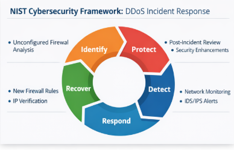
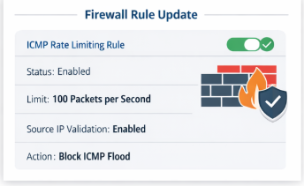
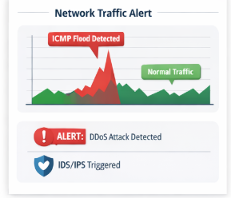
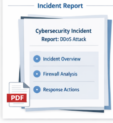
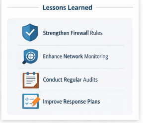

# 🛡️ NIST Cybersecurity Framework: DDoS Incident Response

This project showcases a structured response to a simulated Distributed Denial of Service (DDoS) attack using the **NIST Cybersecurity Framework (CSF)**. It's designed to demonstrate how to analyze, respond to, and recover from a security incident within a corporate environment.

---

## 🔍 Scenario

You're a cybersecurity analyst at a multimedia company that recently experienced a **DDoS attack** that disrupted internal services for two hours. This project documents how the attack was mitigated using a layered defense strategy — aligned with **NIST CSF** principles — and how the company strengthened its network security posture.

---

## 🧠 NIST CSF Functions in Action

The project is broken down according to the **five functions** of the NIST Cybersecurity Framework:

### 1. Identify
- Conducted a post-incident risk analysis revealing an unconfigured firewall.
- Assessed vulnerability severity and exposure risks.

### 2. Protect
- Implemented ICMP rate limiting rules.
- Enabled source IP address verification on the firewall.

### 3. Detect
- Deployed network monitoring software.
- Introduced IDS/IPS filters for abnormal ICMP traffic patterns.

### 4. Respond
- Blocked incoming ICMP packets.
- Restored only critical services during the attack.

### 5. Recover
- Performed a post-incident analysis.
- Implemented long-term improvements in firewall rules, detection tools, and staff training.

---

## 📄 Report Included

Download and review the full written report for in-depth context and strategic alignment with cybersecurity best practices.

📎 [Download Report.pdf](./Report.pdf)

---

## 🛠️ Tools & Frameworks

- **NIST Cybersecurity Framework (CSF)**
- Firewall configuration tools
- Network monitoring software
- IDS/IPS systems

---

## 🎓 Skills Demonstrated

- Security incident analysis  
- Application of NIST CSF  
- Firewall rule strategy  
- Detection and response planning  
- Communication through technical reporting

---

## ⚠️ Disclaimer

This is a simulated project created for educational and portfolio purposes.

---

### ✨ Created by [PayloadProtector](https://github.com/PayloadProtector)
